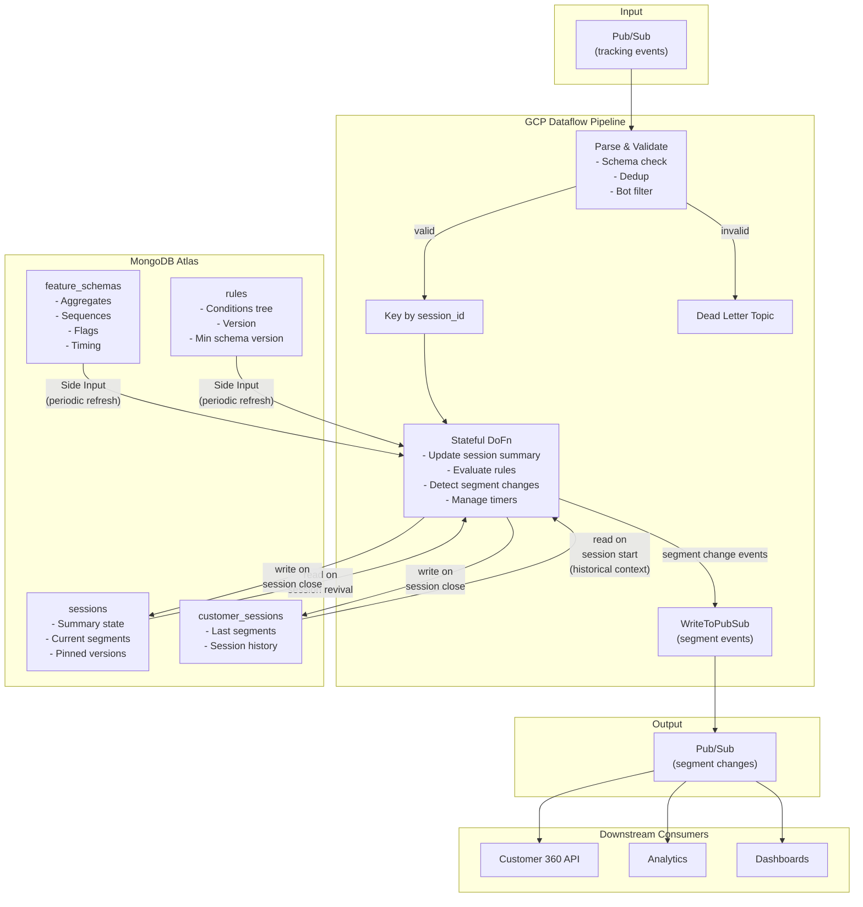
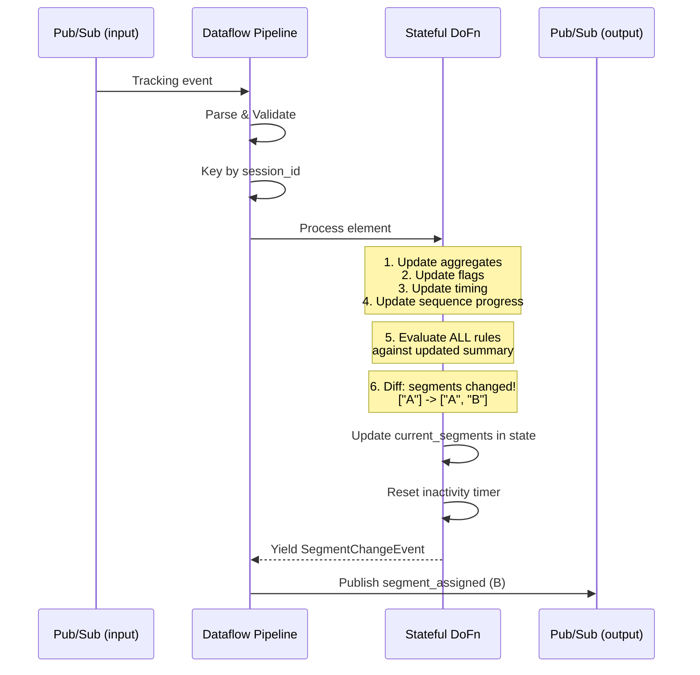
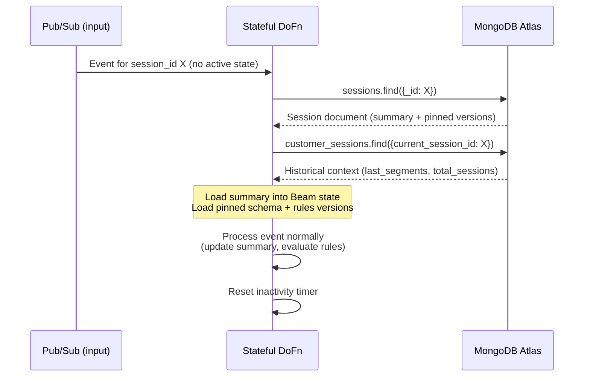
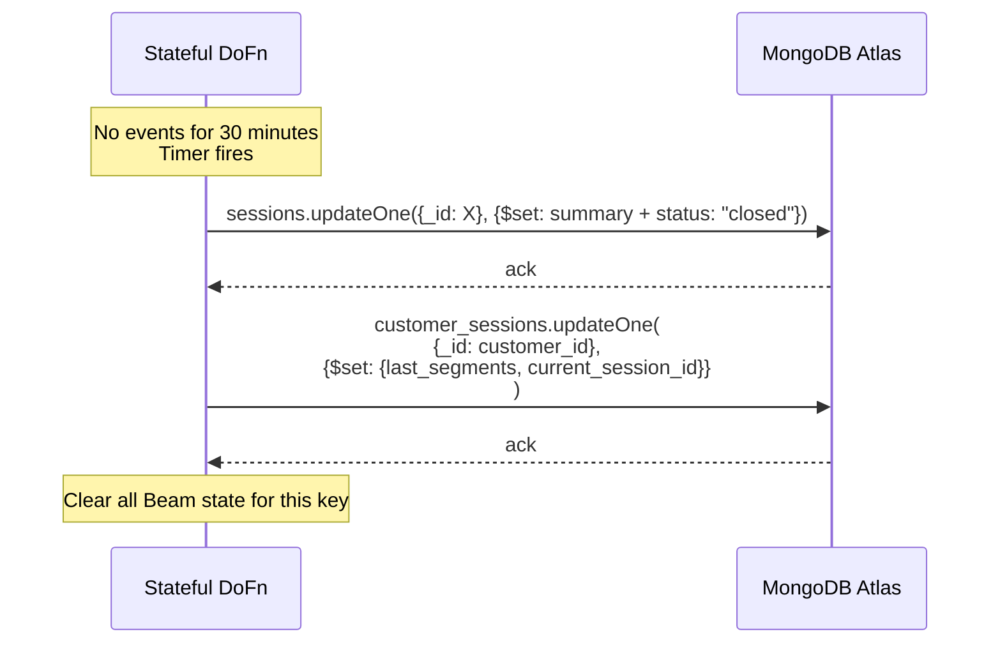
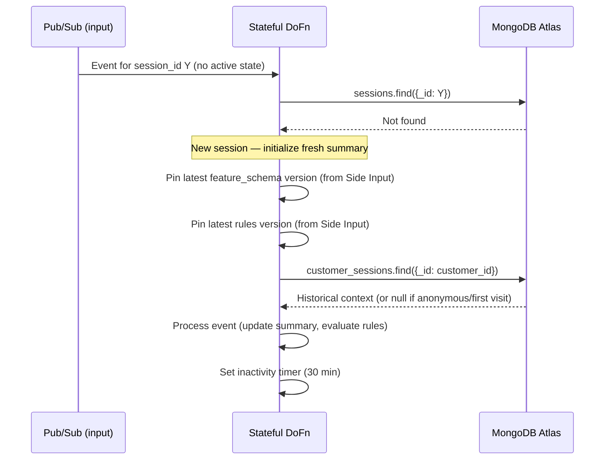
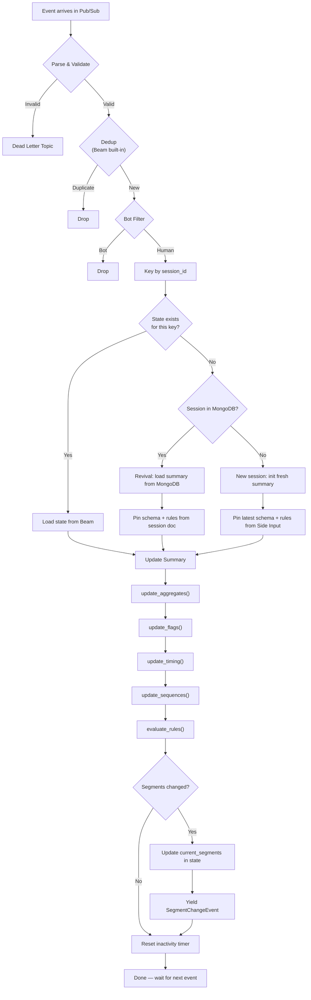
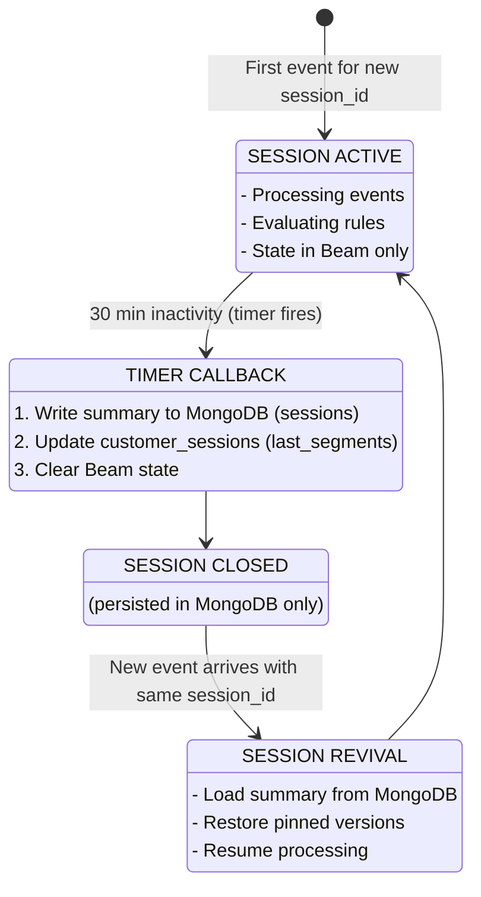
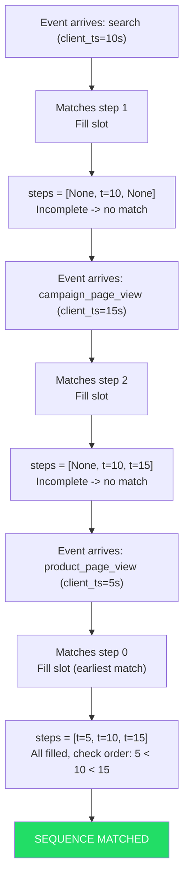

# Real-Time Customer Segmentation Pipeline — Architecture Overview

## Executive Summary

This document describes the architecture for a real-time customer segmentation pipeline built on GCP Dataflow (Apache Beam) with MongoDB Atlas as the stateful storage layer. The solution processes 4k-8k tracking events/second from an e-commerce platform and assigns visitors to behavioral segments within 2 seconds end-to-end.

The pipeline maintains a compact **session summary** per visitor (aggregates, timing, sequence progress, flags) — never raw events. This bounds memory by rule complexity, not event volume. Segment evaluation uses a recursive boolean condition tree that walks the summary on every event.

MongoDB Atlas serves two critical roles:
1. **Durable session state store** — session summaries are checkpointed on session close and revived when a cold session-id reappears
2. **Configuration store** — feature schemas and segment rules are stored as flexible documents, updated without pipeline redeployment

Segment change events are published directly to Pub/Sub from Dataflow — no CDC layer or outbox pattern.

---

## Architecture Diagram



---

## Sequence Diagrams

### Normal Event Processing (Segment Matched)



### Session Revival (Cold Session)



### Session Close (Inactivity Timer Fires)



### New Session (First Event Ever for This Session ID)



---

## Flow Diagrams

### Event Processing Flow (Detail)



### Session Lifecycle



### Sequence Matching with Out-of-Order Events

**Rule:** `product_page_view -> search -> campaign_page_view`



---

## Design Decisions

### Session Management

| Decision | Choice | Rationale |
|----------|--------|-----------|
| Session boundary | 30 min inactivity (Beam session window timer) | Industry standard for e-commerce |
| Session identity | `session_id` from tracking cookie | Avoids identity stitching complexity at this layer |
| State storage during session | Beam state only (no mid-session MongoDB writes) | Beam replicates state; MongoDB is backup for full pipeline restarts |
| Session persistence | Write to MongoDB only on session close (timer fires) | Reduces MongoDB write pressure from ~80-160/s to ~5-15/s |
| Session revival | Load summary from MongoDB when cold session-id reappears | Sessions can outlive Beam windows |
| Revival failure | Start fresh session if MongoDB read fails | Pipeline availability over consistency |

### Summary Approach (No Raw Events)

| Decision | Choice | Rationale |
|----------|--------|-----------|
| State model | Compact summary: aggregates, timing, flags, sequence progress | Bounded by rule count, not event count (~1-2 KB vs ~25 KB) |
| Event ordering | Client timestamps in sequence progress slots (earliest-match semantics) | Zero buffering latency, self-corrects on late arrivals |
| Raw event storage | Never | Summary captures all rule-relevant information; avoids O(events) serialization |
| Eviction | Not needed | Sequence progress persists regardless of event count |

### Feature Schema & Rules (Separated Concerns)

| Decision | Choice | Rationale |
|----------|--------|-----------|
| Feature schema | Independent config in MongoDB, drives what DoFn tracks | Decouples tracking from segmentation; enables ML consumption |
| Segmentation rules | Recursive boolean condition tree over summary fields | Flexible, composable, evaluates in O(rules x conditions) |
| Version pinning | Schema + rules pinned per session at session start | Consistent evaluation within a session lifetime |
| Compatibility | Rules declare `min_feature_schema_version` | Prevents evaluation against incomplete summaries |
| Schema evolution | Additive changes apply to new sessions only | No mid-session state shape changes |

### Output & Delivery

| Decision | Choice | Rationale |
|----------|--------|-----------|
| Segment event delivery | Direct Pub/Sub publish from Dataflow (separate pipeline step) | Simpler than CDC/outbox, lower latency, Beam handles retries |
| Output format | `segment_assigned` / `segment_revoked` events | Idempotent, consumers deduplicate by (session_id, segment_id, timestamp) |
| Write ordering | DoFn yields output element -> Beam commits bundle atomically (state + output) | No dual-write risk within a bundle |
| MongoDB consistency | Eventually consistent (updated on session close) | Pub/Sub is the real-time channel; MongoDB is durable backup |

### ML Integration (Future)

| Decision | Choice | Rationale |
|----------|--------|-----------|
| Feature vector | Session summary IS the feature vector | No separate feature extraction step needed |
| Integration point | Parallel or replacement step after Stateful DoFn | Same pipeline, different evaluation strategy |
| Transition path | Rules -> Shadow mode -> A/B test -> Full ML | Gradual rollout, offline comparison before switching |
| Feature evolution | ML team adds features to schema that rules don't use | Schema serves both consumers independently |

### Reliability

| Decision | Choice | Rationale |
|----------|--------|-----------|
| Worker failure | Beam state replication handles it (no data loss) | Dataflow's streaming engine replicates across workers |
| Full pipeline restart | Sessions start fresh (no mid-session checkpoints) | Acceptable trade-off for reduced MongoDB write pressure |
| MongoDB read failure on revival | Start fresh session | Pipeline availability over state continuity |
| MongoDB write failure on close | Retry with backoff; state remains in Beam until success | Session data not lost unless pipeline also crashes |

---

## Latency Budget

```mermaid
gantt
    title End-to-End Latency Budget (target < 2000ms)
    dateFormat X
    axisFormat %L ms

    section Pipeline
    Pub/Sub to Dataflow        :0, 100
    Parse & Validate           :100, 102
    Stateful DoFn processing   :102, 107
    Bundle commit              :107, 110

    section Output
    Pub/Sub publish            :110, 160
    Customer 360 ingestion     :160, 360
```



| Stage | Estimated Latency |
|-------|------------------|
| Pub/Sub -> Dataflow | ~50-100ms |
| Parse & Validate | ~1-2ms |
| Stateful DoFn (update + evaluate) | ~1-5ms |
| Bundle commit (state + output) | ~1-3ms |
| Pub/Sub publish (batched) | ~10-50ms |
| Customer 360 ingestion | ~100-200ms |
| **Total** | **~170-360ms** (well within 2s SLA) |

---

## Scalability Profile

| Metric | Baseline | Peak |
|--------|----------|------|
| Events/second | 4,000 | 8,000 |
| Concurrent sessions (est.) | ~100,000 | ~200,000 |
| State per session | ~1-2 KB | ~1-2 KB |
| Total Beam state | ~100-200 MB | ~200-400 MB |
| MongoDB writes/second (session close only) | ~5-15 | ~10-30 |
| MongoDB reads/second (session revival) | ~10-50 | ~20-100 |
| Pub/Sub output (segment changes) | ~50-200/s | ~100-400/s |

---

## MongoDB Collections Design

### `sessions`

```javascript
{
  _id: "session_id_abc123",           // session-id as primary key
  customer_id: "42",                   // null if anonymous
  status: "active",                    // active | closed
  feature_schema_version: 4,           // pinned at session start
  rules_version: 7,                    // pinned at session start
  started_at: ISODate("2026-07-08T10:00:00Z"),
  last_event_at: ISODate("2026-07-08T10:15:30Z"),
  event_count: 87,

  aggregates: {
    product_views_count: 12,
    searches_count: 3,
    cart_additions_count: 1,
    campaign_page_views_count: 2
  },

  timing: {
    total_duration_sec: 930,
    last_event_timestamp: ISODate("2026-07-08T10:15:30Z"),
    last_event_type: "product_page_view",
    durations: {
      time_on_product_pages_sec: 245.5
    }
  },

  flags: {
    has_added_to_cart: true,
    has_completed_purchase: false
  },

  sequence_progress: {
    campaign_influenced: {
      step_timestamps: [ISODate("..."), ISODate("..."), null],
      completed: false,
      match_count: 0
    },
    browse_to_cart: {
      step_timestamps: [ISODate("..."), ISODate("..."), ISODate("...")],
      completed: true,
      match_count: 1
    }
  },

  current_segments: ["heavy_browser"],

  historical: {
    last_segments: ["casual_visitor"],
    total_sessions: 4,
    days_since_last_session: 3.2
  }
}
```

### `customer_sessions`

```javascript
{
  _id: "customer_42",                  // customer-id as primary key
  customer_id: "42",
  current_session_id: "session_id_abc123",
  last_segments: ["heavy_browser"],
  total_sessions: 5
}
```

### `feature_schemas`

```javascript
{
  _id: ObjectId("..."),
  version: 4,
  active: true,
  created_at: ISODate("2026-07-10T..."),

  aggregates: [
    { event_type: "product_page_view", field: "product_views_count" },
    { event_type: "search", field: "searches_count" },
    { event_type: "add_to_cart", field: "cart_additions_count" },
    { event_type: "campaign_page_view", field: "campaign_page_views_count" }
  ],

  flags: [
    { event_type: "add_to_cart", field: "has_added_to_cart" },
    { event_type: "purchase", field: "has_completed_purchase" }
  ],

  sequences: [
    {
      name: "campaign_influenced",
      steps: [
        { event_type: "product_page_view" },
        { event_type: "search" },
        { event_type: "campaign_page_view" }
      ]
    },
    {
      name: "browse_to_cart",
      steps: [
        { event_type: "product_page_view" },
        { event_type: "product_page_view", filters: [{ property: "category", operator: "eq", value: "electronics" }] },
        { event_type: "add_to_cart" }
      ]
    }
  ],

  timing: [
    { type: "total_duration" },
    { type: "time_since_last_event" },
    { type: "time_on_event_type", event_type: "product_page_view", field: "time_on_product_pages_sec" }
  ]
}
```

### `rules`

```javascript
{
  _id: ObjectId("..."),
  segment_id: "heavy_browser",
  name: "Heavy Browser",
  version: 2,
  active: true,
  min_feature_schema_version: 3,
  conditions: {
    operator: "AND",
    rules: [
      {
        type: "aggregation",
        field: "product_views_count",
        comparator: "gte",
        value: 10
      },
      {
        type: "timing",
        field: "total_duration_sec",
        comparator: "gte",
        value: 300
      },
      {
        operator: "OR",
        rules: [
          { type: "sequence", name: "campaign_influenced", condition: "completed" },
          { type: "flag", field: "has_added_to_cart", condition: "true" }
        ]
      }
    ]
  }
}
```

---

## Why MongoDB Atlas Fits This Architecture

### 1. Document Model Matches Session State

The session summary is a nested, evolving document — aggregates, sequences, flags, and segment assignments in a single entity. MongoDB's document model stores this naturally without joins or schema migrations. Adding a new aggregate field is a single `$set` operation.

### 2. Flexible Schema for Evolving Configs

Both feature schemas and rules are stored as MongoDB documents with nested structures. No rigid schema means they can evolve (new condition types, new sequence patterns, new ML features) without database migrations.

### 3. Low-Latency Reads for Session Revival

When a cold session-id reappears, the pipeline reads the session summary from MongoDB in ~5-20ms. Document-level reads with indexed lookups on `_id` (session-id) make this fast and predictable under load.

### 4. Atomic Partial Updates

On session close, MongoDB's `$set` operator updates the full summary atomically. For the `customer_sessions` collection, `$set` on `last_segments` and `$inc` on `total_sessions` are single atomic operations.

### 5. TTL Indexes for Automatic Cleanup

Closed sessions that are no longer needed can be automatically removed using MongoDB TTL indexes on the `last_event_at` field. No manual cleanup jobs required.

### 6. Horizontal Scalability

MongoDB Atlas scales via sharding. If session volume grows, sharding by `session_id` distributes load evenly — matching the same key distribution that Beam uses.

---

## Future: ML Model Integration

The session summary is designed as a feature vector from day one:

```
Pub/Sub (input)
    -> Parse/Validate
    -> Stateful DoFn (update summary, evaluate rules)
    -> Branch:
        |-- Segment events -> Pub/Sub (output)         [current]
        |-- Feature vectors -> RunInference -> Pub/Sub  [future ML]
```

### Transition Path

| Phase | Rule eval | ML eval | Who decides segment |
|-------|-----------|---------|---------------------|
| Current | Yes | No | Rules |
| Shadow mode | Yes | Yes (logged to BigQuery) | Rules — ML compared offline |
| A/B test | Yes | Yes | Split by session_id hash |
| Full ML | No | Yes | Model |

### What Enables This

- Feature schema is independent from rules — ML team adds features without touching segmentation logic
- Summary is the same data structure both consumers read
- `RunInference` is a standard Beam transform that slots in after the DoFn
- No architectural changes required — the model is an alternative evaluation strategy
